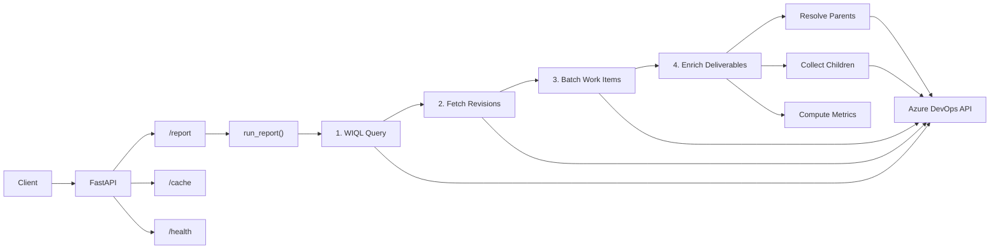
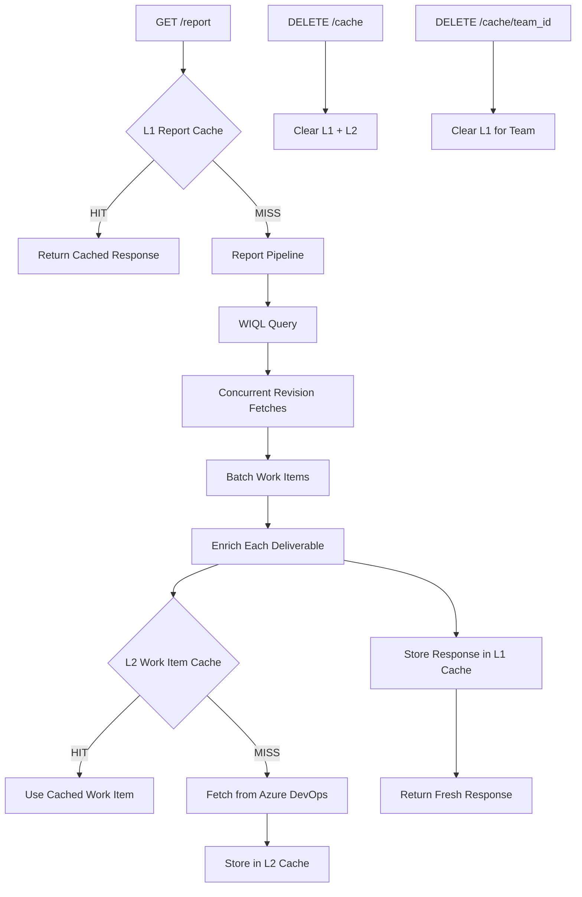

# Azure DevOps Performance Report API

FastAPI service that pulls Azure DevOps work items for configured teams over a date range and returns a normalised performance report (deliverables with hierarchy and linked bugs/tasks).

## Setup

```bash
python3 -m venv .venv
source .venv/bin/activate   # or .venv\Scripts\activate on Windows
pip install -e ".[dev]"
cp .env.example .env
# Edit .env: set AZURE_DEVOPS_ORG and AZURE_DEVOPS_PAT
```

## Run

```bash
uvicorn app.main:app --reload
```

Base URL (local): `http://localhost:8000`

---

## Architecture

### API Request Flow




### Caching Layer




The two cache layers target different bottlenecks:


| Layer          | Key                               | Scope            | Effect                                                 |
| -------------- | --------------------------------- | ---------------- | ------------------------------------------------------ |
| L1 (Report)    | `(team_id, start_date, end_date)` | Full response    | Repeated identical queries: 0 API calls                |
| L2 (Work Item) | `(project, work_item_id)`         | Individual items | Shared epics/features fetched once across deliverables |


Both are in-memory, persist until process restart, and support manual invalidation via the `/cache` endpoints.

---

## Endpoints

### Health

```
GET /health
```

No parameters. Returns `{"status": "ok"}`. Pass `?deep=true` to verify Azure DevOps connectivity.

---

### 1. Dashboard

Cross-team KPI averages and per-team breakdown.

```
GET /dashboard?start_date=2025-01-01&end_date=2025-01-31
```


| Parameter    | Type | Required | Description           |
| ------------ | ---- | -------- | --------------------- |
| `start_date` | date | Yes      | Start of period (ISO) |
| `end_date`   | date | Yes      | End of period (ISO)   |


**Response** `200 OK`

```json
{
  "start_date": "2025-01-01",
  "end_date": "2025-01-31",
  "averages": [
    {"name": "rework_rate", "value": 0.08, "display": "8.0%", "rag": "green", "team_count": 5},
    {"name": "delivery_predictability", "value": 0.87, "display": "87.0%", "rag": "green", "team_count": 5}
  ],
  "teams": [
    {
      "team_id": "game-services",
      "kpis": [
        {"name": "rework_rate", "value": 0.10, "display": "10.0%", "rag": "green", "items_with_rework": 5, "items_reached_qa": 50, "items_bounced_back": 3, "total_bugs": 8, "thresholds": {"green": "<= 10%", "amber": "10-15%", "red": "> 15%"}},
        {"name": "delivery_predictability", "value": 0.90, "display": "90.0%", "rag": "green", "items_committed": 50, "items_deployed": 45, "items_started_in_period": 35, "items_spillover": 15, "thresholds": {"green": ">= 85%", "amber": "70%-85%", "red": "< 70%"}}
      ]
    }
  ],
  "errors": []
}
```

---

### 2. Team KPIs

All KPIs for one team.

```
GET /teams/{team_id}/kpis?start_date=2025-01-01&end_date=2025-01-31
```


| Parameter    | Type | Required | Description                      |
| ------------ | ---- | -------- | -------------------------------- |
| `team_id`    | path | Yes      | Team slug (e.g. `game-services`) |
| `start_date` | date | Yes      | Start of period (ISO)            |
| `end_date`   | date | Yes      | End of period (ISO)              |


**Response** `200 OK`

```json
{
  "team_id": "game-services",
  "start_date": "2025-01-01",
  "end_date": "2025-01-31",
  "kpis": [
    {"name": "rework_rate", "value": 0.10, "display": "10.0%", "rag": "green", "items_with_rework": 5, "items_reached_qa": 50, "items_bounced_back": 3, "total_bugs": 8, "thresholds": {"green": "<= 10%", "amber": "10-15%", "red": "> 15%"}},
    {"name": "delivery_predictability", "value": 0.90, "display": "90.0%", "rag": "green", "items_committed": 50, "items_deployed": 45, "items_started_in_period": 35, "items_spillover": 15, "thresholds": {"green": ">= 85%", "amber": "70%-85%", "red": "< 70%"}}
  ]
}
```

---

### 3. Team KPI Detail

Single KPI with its breakdown metrics and all involved work items for one team.

```
GET /teams/{team_id}/kpis/{kpi_name}?start_date=2025-01-01&end_date=2025-01-31
```

| Parameter | Type | Required | Description |
|-----------|------|----------|-------------|
| `team_id` | path | Yes | Team slug |
| `kpi_name` | path | Yes | `rework-rate` or `delivery-predictability` |
| `start_date` | date | Yes | Start of period (ISO) |
| `end_date` | date | Yes | End of period (ISO) |

**Response** `200 OK` (example: rework-rate)

```json
{
  "team_id": "game-services",
  "start_date": "2025-01-01",
  "end_date": "2025-01-31",
  "kpi": {
    "name": "rework_rate",
    "value": 0.10,
    "display": "10.0%",
    "rag": "green",
    "items_with_rework": 5,
    "items_reached_qa": 50,
    "items_bounced_back": 3,
    "total_bugs": 8,
    "thresholds": {"green": "<= 10%", "amber": "10-15%", "red": "> 15%"}
  },
  "total": 50,
  "items": [
    {"id": 12345, "work_item_type": "Story", "title": "Implement checkout flow", "...": "..."},
    {"id": 12349, "work_item_type": "Task", "title": "Add unit tests", "...": "..."}
  ]
}
```

The `items` list is the deduplicated union of all work items across every metric of the KPI (e.g. for rework-rate: items that reached QA, had rework, bounced back, or have bugs).

---

### 4. KPI Drilldown

Work items behind a specific KPI metric. Supports `skip`/`limit` pagination.

```
GET /teams/{team_id}/kpis/{kpi_name}/drilldown/{metric}?start_date=2025-01-01&end_date=2025-01-31
```


| Parameter    | Type | Required | Description                                |
| ------------ | ---- | -------- | ------------------------------------------ |
| `team_id`    | path | Yes      | Team slug                                  |
| `kpi_name`   | path | Yes      | `rework-rate` or `delivery-predictability` |
| `metric`     | path | Yes      | Metric to drill into (see table below)     |
| `start_date` | date | Yes      | Start of period (ISO)                      |
| `end_date`   | date | Yes      | End of period (ISO)                        |
| `skip`       | int  | No       | Pagination offset (default 0)              |
| `limit`      | int  | No       | Max items (default 100, max 500)           |


**Available metrics per KPI:**


| KPI                       | Valid metrics                                                                     |
| ------------------------- | --------------------------------------------------------------------------------- |
| `rework-rate`             | `items_reached_qa`, `items_with_rework`, `items_bounced_back`, `items_with_bugs`  |
| `delivery-predictability` | `items_committed`, `items_deployed`, `items_started_in_period`, `items_spillover` |


**Response** `200 OK`

```json
{
  "team_id": "game-services",
  "start_date": "2025-01-01",
  "end_date": "2025-01-31",
  "kpi_name": "rework-rate",
  "metric": "items_with_rework",
  "total": 5,
  "items": [
    {"id": 12345, "work_item_type": "Story", "title": "Implement checkout flow", "...": "..."}
  ]
}
```

---

### 5. Work Items

Paginated list of work items (deliverables) for one team. Replaces the former `/report` endpoint.

```
GET /teams/{team_id}/work-items?start_date=2025-01-01&end_date=2025-01-31
```


| Parameter    | Type | Required | Description                      |
| ------------ | ---- | -------- | -------------------------------- |
| `team_id`    | path | Yes      | Team slug                        |
| `start_date` | date | Yes      | Start of period (ISO)            |
| `end_date`   | date | Yes      | End of period (ISO)              |
| `skip`       | int  | No       | Pagination offset (default 0)    |
| `limit`      | int  | No       | Max items (default 100, max 500) |


**Response** `200 OK`

```json
{
  "team_id": "game-services",
  "start_date": "2025-01-01",
  "end_date": "2025-01-31",
  "total": 42,
  "items": [
    {
      "id": 12345,
      "work_item_type": "Story",
      "title": "Implement checkout flow",
      "state": "Closed",
      "canonical_status": "Delivered",
      "date_created": "2024-12-10T09:00:00Z",
      "start_date": "2024-12-15T10:00:00Z",
      "finish_date": "2025-01-20T09:00:00Z",
      "status_at_start": "Active",
      "status_at_end": "Closed",
      "has_rework": true,
      "is_spillover": false,
      "bounces": 0,
      "is_technical_debt": false,
      "is_post_mortem": true,
      "post_mortem_sla_met": true,
      "delivery_days": 5.38,
      "tags": ["Code Defect"]
    }
  ]
}
```

**Common error responses (all endpoints):**

- `400` -- `start_date` after `end_date` or exceeds max range
- `404` -- Unknown `team_id`
- `422` -- Invalid KPI name or metric
- `503` -- Azure DevOps not configured
- `504` -- Report generation timed out

---

## Status Timeline & Period Boundaries

Each deliverable includes:


| Field             | Description                                                                                               |
| ----------------- | --------------------------------------------------------------------------------------------------------- |
| `description`     | Work item description (HTML or plain text as stored in Azure DevOps)                                      |
| `status_at_start` | State of the item at the beginning of the queried period (`null` if created after)                        |
| `status_at_end`   | State of the item at the end of the queried period                                                        |
| `status_timeline` | Chronological list of state transitions, each with `date`, `state`, `canonical_status`, and `assigned_to` |


The timeline only includes revisions where the state actually changed (consecutive duplicates are skipped).

---

## Role Assignment

Each deliverable includes three role fields computed from revision history:


| Field             | Logic                                                                     |
| ----------------- | ------------------------------------------------------------------------- |
| `developer`       | Person assigned for the longest time during **Development Active** states |
| `qa`              | Person assigned for the longest time during **QA Active** states          |
| `release_manager` | Person assigned for the longest time during **Delivered** states          |


Values are `null` when no one was assigned during the corresponding phase.

---

## Tags & Rework

Each deliverable includes tags, boolean flags, and bounce tracking:


| Field            | Description                                                                                 |
| ---------------- | ------------------------------------------------------------------------------------------- |
| `has_rework`     | `true` if any rework tag is present (`Code Defect` or `Scope / Requirements`)               |
| `is_spillover`   | `true` if the item was already in dev or QA at the start of the period                      |
| `bounces`        | Number of times the item went back from QA/Delivered to active/backlog                      |
| `bounce_details` | List of bounce events with `from_revision`, `to_revision`, `from_state`, `to_state`, `date` |
| `tags`           | List of tags assigned to the deliverable (see below)                                        |


**Available tags:**


| Tag                    | Condition                                                                                                       |
| ---------------------- | --------------------------------------------------------------------------------------------------------------- |
| `Code Defect`          | The work item has one or more linked child bugs (`child_bugs` non-empty).                                       |
| `Scope / Requirements` | The item bounced back at least once (`bounces > 0`).                                                            |
| `Spillover`            | The item was in **Development Active** or **QA Active** at the start of the queried period (`status_at_start`). |


A deliverable can have multiple tags simultaneously (e.g. both `Code Defect` and `Spillover`).

---

## Technical Debt & Post-Mortem

Each deliverable is checked against per-team epic ID lists from `teams.yaml`:


| Field                 | Description                                                                                                            |
| --------------------- | ---------------------------------------------------------------------------------------------------------------------- |
| `parent_epic`         | Parent Epic as `{id, title, state}` object (null if none)                                                              |
| `parent_feature`      | Parent Feature as `{id, title, state}` object (null if none)                                                           |
| `child_bugs`          | List of child bugs as `{id, title, state}` objects                                                                     |
| `child_tasks`         | List of child tasks as `{id, title, state}` objects                                                                    |
| `is_technical_debt`   | `true` if `parent_epic.id` is in the team's `tech_debt_epic_ids` list                                                  |
| `is_post_mortem`      | `true` if `parent_epic.id` is in the team's `post_mortem_epic_ids` list                                                |
| `post_mortem_sla_met` | `true` if `delivery_days <= post_mortem_sla_weeks * 7`. `false` if not yet delivered. `null` if not a post-mortem item |
| `delivery_days`       | Calendar days from work item creation (first revision) to first Delivered state. `null` if not yet delivered           |


**YAML config per team:**

```yaml
tech_debt_epic_ids: [1234, 5678]
post_mortem_epic_ids: [9001]
post_mortem_sla_weeks: 2
```

---

## Cache Management

The API includes an in-memory two-layer cache to reduce Azure DevOps API calls:

- **L1 (Report cache):** Caches full report responses keyed by `(team_id, start_date, end_date)`. Repeated identical queries return instantly.
- **L2 (Work-item cache):** Caches individual work-item lookups used during parent/child resolution. Shared across all report requests.

Both layers persist for the lifetime of the process and are cleared on restart. Use the endpoints below for manual invalidation.

### Invalidate all caches

**Request**

```
DELETE /cache
```

**Response** `200 OK`

```json
{
  "cleared": {
    "reports": 5,
    "work_items": 142
  }
}
```

### Invalidate cache for a specific team

**Request**

```
DELETE /cache/{team_id}
```

**Response** `200 OK`

```json
{
  "team_id": "game-services",
  "cleared": {
    "reports": 2
  }
}
```

### Cache stats

**Request**

```
GET /cache/stats
```

**Response** `200 OK`

```json
{
  "report_cache_entries": 3,
  "work_item_cache_entries": 87
}
```

---

## Authentication

Set the `API_KEY` environment variable to enable API key authentication. When set, all `/dashboard`, `/teams`, and `/cache` endpoints require the `X-API-Key` header. The `/health` endpoint remains open.

```bash
# .env
API_KEY=your-secret-key
```

When `API_KEY` is empty or unset, authentication is disabled (open access).

---

## Rate Limiting

Endpoints are rate-limited per client IP:


| Endpoint                                                  | Limit              |
| --------------------------------------------------------- | ------------------ |
| `GET /dashboard`                                          | 10 requests/minute |
| `GET /teams/{team_id}/work-items`                         | 30 requests/minute |
| `GET /teams/{team_id}/kpis`                               | 30 requests/minute |
| `GET /teams/{team_id}/kpis/{kpi_name}`                    | 30 requests/minute |
| `GET /teams/{team_id}/kpis/{kpi_name}/drilldown/{metric}` | 30 requests/minute |


Exceeding the limit returns `429 Too Many Requests`.

---

## Pagination

Work-items and drilldown endpoints support `skip` and `limit` query parameters:


| Parameter | Default | Range | Description             |
| --------- | ------- | ----- | ----------------------- |
| `skip`    | 0       | >= 0  | Number of items to skip |
| `limit`   | 100     | 1-500 | Max items to return     |


The response includes a `total` field with the full count before pagination.

```
GET /teams/game-services/work-items?start_date=2025-01-01&end_date=2025-01-31&skip=0&limit=50
```

---

## Environment Variables


| Variable               | Default | Description                                   |
| ---------------------- | ------- | --------------------------------------------- |
| `AZURE_DEVOPS_ORG`     |         | Azure DevOps organization name                |
| `AZURE_DEVOPS_PAT`     |         | Personal access token                         |
| `API_KEY`              |         | API key for authentication (empty = disabled) |
| `LOG_LEVEL`            | `INFO`  | Logging level (DEBUG, INFO, WARNING, ERROR)   |
| `REPORT_TIMEOUT`       | `300`   | Max seconds for report generation             |
| `REPORT_CACHE_MAX`     | `256`   | Max L1 cache entries                          |
| `WI_CACHE_MAX`         | `4096`  | Max L2 cache entries                          |
| `REVISION_CONCURRENCY` | `20`    | Max parallel revision fetches                 |
| `HTTP_TIMEOUT`         | `60`    | Seconds per HTTP request                      |
| `HTTP_POOL_SIZE`       | `20`    | Connection pool size                          |
| `MAX_DATE_RANGE_DAYS`  | `365`   | Max allowed date range                        |


---

## KPI Reference

KPIs are computed from report data (no additional Azure DevOps calls). Thresholds are configurable in `app/config/kpis.yaml`.

### Rework Rate

```
rework_rate = items_with_rework / items_reached_qa
```


| RAG   | Threshold |
| ----- | --------- |
| Green | <= 10%    |
| Amber | 10-15%    |
| Red   | > 15%     |


### Delivery Predictability

```
delivery_predictability = items_deployed / items_committed
```

Where `items_committed` = items started in the period (non-spillovers with `start_date` in range) + spillovers (items already active before the period). `items_deployed` = committed items that ended the period in Delivered status.


| RAG   | Threshold |
| ----- | --------- |
| Green | >= 85%    |
| Amber | 70-85%    |
| Red   | < 70%     |


All thresholds are configurable in `app/config/kpis.yaml`.

---

## Config

Edit `app/config/teams.yaml` to set project, area_paths, deliverable_types, container_types, bug_types, state mappings, tech_debt_epic_ids, post_mortem_epic_ids, and post_mortem_sla_weeks per team. The five default teams are: **game-services**, **domain-tooling-service**items_with_rework**s**, **payment-services**, **player-engagement-services**, **rules-engine**.

**Canonical statuses** (each maps from real Azure DevOps states; configurable per team in `states`):


| Canonical status   | Example real states                  |
| ------------------ | ------------------------------------ |
| Development Active | Active, Onhold, Blocked, Code Review |
| QA Active          | Ready for QA, In QA, QA bug pending  |
| Delivered          | Release Candidate, Closed, Resolved  |
| Backlog            | New, Ready                           |


---

## Postman

Import `postman_collection.json` into Postman to run the same requests. Set the `base_url` variable (e.g. `http://localhost:8000`) and optionally add env vars for query params.