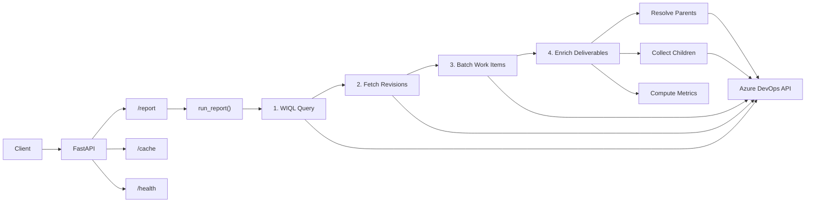
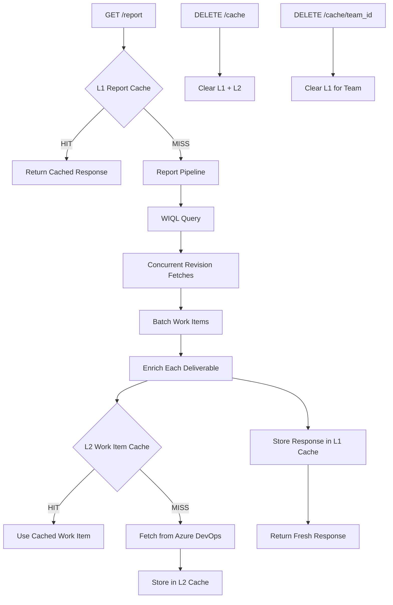

# Azure DevOps Performance Report API

FastAPI service that pulls Azure DevOps work items for configured teams over a date range and returns a normalised performance report (deliverables with hierarchy and linked bugs/tasks).

## Setup

```bash
python3 -m venv .venv
source .venv/bin/activate   # or .venv\Scripts\activate on Windows
pip install -e ".[dev]"
cp .env.example .env
# Edit .env: set AZURE_DEVOPS_ORG and AZURE_DEVOPS_PAT
```

## Run

```bash
uvicorn app.main:app --reload
```

Base URL (local): `http://localhost:8000`

---

## Architecture

### API Request Flow



### Caching Layer



The two cache layers target different bottlenecks:

| Layer | Key | Scope | Effect |
|-------|-----|-------|--------|
| L1 (Report) | `(team_id, start_date, end_date)` | Full response | Repeated identical queries: 0 API calls |
| L2 (Work Item) | `(project, work_item_id)` | Individual items | Shared epics/features fetched once across deliverables |

Both are in-memory, persist until process restart, and support manual invalidation via the `/cache` endpoints.

---

## Endpoints

### Health

**Request**

```
GET /health
```

No parameters.

**Response** `200 OK`

```json
{
  "status": "ok"
}
```

---

### Report (single team)

**Request**

```
GET /report?team_id={team_id}&start_date={start_date}&end_date={end_date}
```

| Parameter    | Type | Required | Description                          |
|-------------|------|----------|--------------------------------------|
| `team_id`   | string | Yes    | Team slug (e.g. `game-services`)      |
| `start_date`| date   | Yes    | Start of period, ISO (e.g. `2025-01-01`) |
| `end_date`  | date   | Yes    | End of period, ISO (e.g. `2025-01-31`)   |

**Example request**

```
GET http://localhost:8000/report?team_id=game-services&start_date=2025-01-01&end_date=2025-01-31
```

**Response** `200 OK`

```json
{
  "team_id": "game-services",
  "start_date": "2025-01-01",
  "end_date": "2025-01-31",
  "deliverables": [
    {
      "id": 12345,
      "work_item_type": "Story",
      "title": "Implement checkout flow",
      "description": "<div>Build the full checkout flow for payment processing.</div>",
      "state": "Closed",
      "canonical_status": "Delivered",
      "date_created": "2024-12-10T09:00:00Z",
      "start_date": "2024-12-15T10:00:00Z",
      "finish_date": "2025-01-20T09:00:00Z",
      "status_at_start": "Active",
      "status_at_end": "Closed",
      "status_timeline": [
        {"date": "2024-12-15T10:00:00Z", "state": "Active", "canonical_status": "Development Active", "assigned_to": "Alice Smith"},
        {"date": "2025-01-10T14:30:00Z", "state": "In QA", "canonical_status": "QA Active", "assigned_to": "Bob Jones"},
        {"date": "2025-01-20T09:00:00Z", "state": "Closed", "canonical_status": "Delivered", "assigned_to": "Carol White"}
      ],
      "parent_epic": {"id": 5000, "title": "Post-Mortem Fixes", "state": "Active"},
      "parent_feature": {"id": 5010, "title": "Payment MVP", "state": "Active"},
      "child_bugs": [{"id": 12346, "title": "Null pointer on checkout", "state": "Closed"}],
      "child_tasks": [{"id": 12347, "title": "DB migration", "state": "Closed"}, {"id": 12348, "title": "API contract", "state": "Closed"}],
      "developer": "Alice Smith",
      "qa": "Bob Jones",
      "release_manager": "Carol White",
      "has_rework": true,
      "is_spillover": false,
      "bounces": 0,
      "bounce_details": [],
      "is_technical_debt": false,
      "is_post_mortem": true,
      "post_mortem_sla_met": true,
      "delivery_days": 5.38,
      "tags": ["Code Defect"]
    },
    {
      "id": 12349,
      "work_item_type": "Task",
      "title": "Add unit tests",
      "description": null,
      "state": "In Progress",
      "canonical_status": "Development Active",
      "date_created": "2024-12-18T09:00:00Z",
      "start_date": "2024-12-20T08:00:00Z",
      "finish_date": null,
      "status_at_start": "In QA",
      "status_at_end": "Active",
      "status_timeline": [
        {"date": "2024-12-20T08:00:00Z", "state": "In QA", "canonical_status": "QA Active", "assigned_to": "Bob Jones"},
        {"date": "2025-01-05T08:00:00Z", "state": "Active", "canonical_status": "Development Active", "assigned_to": "Alice Smith"}
      ],
      "parent_epic": null,
      "parent_feature": null,
      "child_bugs": [],
      "child_tasks": [],
      "developer": "Alice Smith",
      "qa": "Bob Jones",
      "release_manager": null,
      "has_rework": true,
      "is_spillover": true,
      "bounces": 1,
      "bounce_details": [
        {"from_revision": 7, "to_revision": 8, "from_state": "In QA", "to_state": "Active", "date": "2025-01-05T08:00:00Z"}
      ],
      "is_technical_debt": false,
      "is_post_mortem": false,
      "post_mortem_sla_met": null,
      "delivery_days": null,
      "tags": ["Scope / Requirements", "Spillover"]
    }
  ]
}
```

**Error responses**

- `400` – `start_date` is after `end_date`
  ```json
  { "detail": "start_date must be <= end_date" }
  ```
- `404` – Unknown `team_id`
  ```json
  { "detail": "Unknown team_id: foo. Known: ['game-services', 'domain-tooling-services', ...]" }
  ```
- `503` – Azure DevOps not configured (missing org or PAT)
  ```json
  { "detail": "Azure DevOps not configured: set AZURE_DEVOPS_ORG and AZURE_DEVOPS_PAT" }
  ```

---

### Report (multiple teams)

**Request**

```
GET /report/multi?team_ids={team_ids}&start_date={start_date}&end_date={end_date}
```

| Parameter    | Type | Required | Description                                   |
|-------------|------|----------|-----------------------------------------------|
| `team_ids`  | string | Yes    | Comma-separated team slugs                     |
| `start_date`| date   | Yes    | Start of period, ISO (e.g. `2025-01-01`)      |
| `end_date`  | date   | Yes    | End of period, ISO (e.g. `2025-01-31`)        |

**Example request**

```
GET http://localhost:8000/report/multi?team_ids=game-services,payment-services&start_date=2025-01-01&end_date=2025-01-31
```

**Response** `200 OK`

```json
{
  "teams": [
    {
      "team_id": "game-services",
      "deliverables": [
        {
          "id": 12345,
          "work_item_type": "Story",
          "title": "Implement checkout flow",
          "description": "<div>Build the full checkout flow.</div>",
          "state": "Closed",
          "canonical_status": "Delivered",
          "date_created": "2024-12-10T09:00:00Z",
          "start_date": "2024-12-15T10:00:00Z",
          "finish_date": "2025-01-20T09:00:00Z",
          "status_at_start": "Active",
          "status_at_end": "Closed",
          "status_timeline": [
            {"date": "2024-12-15T10:00:00Z", "state": "Active", "canonical_status": "Development Active", "assigned_to": "Alice Smith"},
            {"date": "2025-01-20T09:00:00Z", "state": "Closed", "canonical_status": "Delivered", "assigned_to": "Carol White"}
          ],
          "parent_epic": null,
          "parent_feature": {"id": 5010, "title": "Payment MVP", "state": "Active"},
          "has_rework": true,
          "is_spillover": false,
          "bounces": 0,
          "bounce_details": [],
          "is_technical_debt": false,
          "is_post_mortem": false,
          "post_mortem_sla_met": null,
          "delivery_days": 36.96,
          "tags": ["Code Defect"],
          "child_bugs": [{"id": 12346, "title": "Null pointer on checkout", "state": "Closed"}],
          "child_tasks": [{"id": 12347, "title": "DB migration", "state": "Closed"}, {"id": 12348, "title": "API contract", "state": "Closed"}],
          "developer": "Alice Smith",
          "qa": "Bob Jones",
          "release_manager": "Carol White"
        }
      ]
    },
    {
      "team_id": "payment-services",
      "deliverables": [
        {
          "id": 12400,
          "work_item_type": "Story",
          "title": "Refund API",
          "description": "Implement refund processing via API.",
          "state": "In Testing",
          "canonical_status": "QA Active",
          "date_created": "2024-12-18T09:00:00Z",
          "start_date": "2024-12-20T11:00:00Z",
          "finish_date": null,
          "status_at_start": "Active",
          "status_at_end": "In QA",
          "status_timeline": [
            {"date": "2024-12-20T11:00:00Z", "state": "Active", "canonical_status": "Development Active", "assigned_to": "Dave Brown"},
            {"date": "2025-01-15T16:00:00Z", "state": "In QA", "canonical_status": "QA Active", "assigned_to": "Eve Green"}
          ],
          "parent_epic": {"id": 9001, "title": "Tech Debt Q1", "state": "Active"},
          "parent_feature": {"id": 9010, "title": "Refunds", "state": "Active"},
          "has_rework": false,
          "is_spillover": true,
          "bounces": 0,
          "bounce_details": [],
          "is_technical_debt": true,
          "is_post_mortem": false,
          "post_mortem_sla_met": null,
          "delivery_days": null,
          "tags": ["Spillover"],
          "child_bugs": [],
          "child_tasks": [{"id": 12401, "title": "Write integration tests", "state": "Active"}],
          "developer": "Dave Brown",
          "qa": "Eve Green",
          "release_manager": null
        }
      ]
    }
  ]
}
```

**Error responses**

- `400` – `start_date` is after `end_date`
  ```json
  { "detail": "start_date must be <= end_date" }
  ```
- `404` – One or more unknown `team_id`s
  ```json
  { "detail": "Unknown team_id(s): ['foo']" }
  ```
- `503` – Azure DevOps not configured (same as single-team report)

---

## Status Timeline & Period Boundaries

Each deliverable includes:

| Field | Description |
|-------|-------------|
| `description` | Work item description (HTML or plain text as stored in Azure DevOps) |
| `status_at_start` | State of the item at the beginning of the queried period (`null` if created after) |
| `status_at_end` | State of the item at the end of the queried period |
| `status_timeline` | Chronological list of state transitions, each with `date`, `state`, `canonical_status`, and `assigned_to` |

The timeline only includes revisions where the state actually changed (consecutive duplicates are skipped).

---

## Role Assignment

Each deliverable includes three role fields computed from revision history:

| Field | Logic |
|-------|-------|
| `developer` | Person assigned for the longest time during **Development Active** states |
| `qa` | Person assigned for the longest time during **QA Active** states |
| `release_manager` | Person assigned for the longest time during **Delivered** states |

Values are `null` when no one was assigned during the corresponding phase.

---

## Tags & Rework

Each deliverable includes tags, boolean flags, and bounce tracking:

| Field | Description |
|-------|-------------|
| `has_rework` | `true` if any rework tag is present (`Code Defect` or `Scope / Requirements`) |
| `is_spillover` | `true` if the item was already in dev or QA at the start of the period |
| `bounces` | Number of times the item went back from QA/Delivered to active/backlog |
| `bounce_details` | List of bounce events with `from_revision`, `to_revision`, `from_state`, `to_state`, `date` |
| `tags` | List of tags assigned to the deliverable (see below) |

**Available tags:**

| Tag | Condition |
|-----|-----------|
| `Code Defect` | The work item has one or more linked child bugs (`child_bugs` non-empty). |
| `Scope / Requirements` | The item bounced back at least once (`bounces > 0`). |
| `Spillover` | The item was in **Development Active** or **QA Active** at the start of the queried period (`status_at_start`). |

A deliverable can have multiple tags simultaneously (e.g. both `Code Defect` and `Spillover`).

---

## Technical Debt & Post-Mortem

Each deliverable is checked against per-team epic ID lists from `teams.yaml`:

| Field | Description |
|-------|-------------|
| `parent_epic` | Parent Epic as `{id, title, state}` object (null if none) |
| `parent_feature` | Parent Feature as `{id, title, state}` object (null if none) |
| `child_bugs` | List of child bugs as `{id, title, state}` objects |
| `child_tasks` | List of child tasks as `{id, title, state}` objects |
| `is_technical_debt` | `true` if `parent_epic.id` is in the team's `tech_debt_epic_ids` list |
| `is_post_mortem` | `true` if `parent_epic.id` is in the team's `post_mortem_epic_ids` list |
| `post_mortem_sla_met` | `true` if `delivery_days <= post_mortem_sla_weeks * 7`. `false` if not yet delivered. `null` if not a post-mortem item |
| `delivery_days` | Calendar days from work item creation (first revision) to first Delivered state. `null` if not yet delivered |

**YAML config per team:**

```yaml
tech_debt_epic_ids: [1234, 5678]
post_mortem_epic_ids: [9001]
post_mortem_sla_weeks: 2
```

---

## Cache Management

The API includes an in-memory two-layer cache to reduce Azure DevOps API calls:

- **L1 (Report cache):** Caches full report responses keyed by `(team_id, start_date, end_date)`. Repeated identical queries return instantly.
- **L2 (Work-item cache):** Caches individual work-item lookups used during parent/child resolution. Shared across all report requests.

Both layers persist for the lifetime of the process and are cleared on restart. Use the endpoints below for manual invalidation.

### Invalidate all caches

**Request**

```
DELETE /cache
```

**Response** `200 OK`

```json
{
  "cleared": {
    "reports": 5,
    "work_items": 142
  }
}
```

### Invalidate cache for a specific team

**Request**

```
DELETE /cache/{team_id}
```

**Response** `200 OK`

```json
{
  "team_id": "game-services",
  "cleared": {
    "reports": 2
  }
}
```

### Cache stats

**Request**

```
GET /cache/stats
```

**Response** `200 OK`

```json
{
  "report_cache_entries": 3,
  "work_item_cache_entries": 87
}
```

---

## Authentication

Set the `API_KEY` environment variable to enable API key authentication. When set, all `/report` and `/cache` endpoints require the `X-API-Key` header. The `/health` endpoint remains open.

```bash
# .env
API_KEY=your-secret-key
```

When `API_KEY` is empty or unset, authentication is disabled (open access).

---

## Rate Limiting

Report endpoints are rate-limited per client IP:

| Endpoint | Limit |
|----------|-------|
| `GET /report` | 30 requests/minute |
| `GET /report/multi` | 10 requests/minute |

Exceeding the limit returns `429 Too Many Requests`.

---

## Pagination

Report endpoints support `skip` and `limit` query parameters:

| Parameter | Default | Range | Description |
|-----------|---------|-------|-------------|
| `skip` | 0 | >= 0 | Number of deliverables to skip |
| `limit` | 100 | 1-500 | Max deliverables to return |

The response includes a `total` field with the full count before pagination.

```
GET /report?team_id=game-services&start_date=2025-01-01&end_date=2025-01-31&skip=0&limit=50
```

---

## Environment Variables

| Variable | Default | Description |
|----------|---------|-------------|
| `AZURE_DEVOPS_ORG` | | Azure DevOps organization name |
| `AZURE_DEVOPS_PAT` | | Personal access token |
| `API_KEY` | | API key for authentication (empty = disabled) |
| `LOG_LEVEL` | `INFO` | Logging level (DEBUG, INFO, WARNING, ERROR) |
| `REPORT_TIMEOUT` | `300` | Max seconds for report generation |
| `REPORT_CACHE_MAX` | `256` | Max L1 cache entries |
| `WI_CACHE_MAX` | `4096` | Max L2 cache entries |
| `REVISION_CONCURRENCY` | `20` | Max parallel revision fetches |
| `HTTP_TIMEOUT` | `60` | Seconds per HTTP request |
| `HTTP_POOL_SIZE` | `20` | Connection pool size |
| `MAX_DATE_RANGE_DAYS` | `365` | Max allowed date range |

---

## KPIs

KPIs are computed from the existing report data (no additional Azure DevOps calls). Thresholds are configurable in `app/config/kpis.yaml`.

### `GET /kpi` -- single team

```
GET /kpi?team_id=game-services&start_date=2025-01-01&end_date=2025-01-31
```

Response:

```json
{
  "team_id": "game-services",
  "start_date": "2025-01-01",
  "end_date": "2025-01-31",
  "kpis": [
    {
      "name": "rework_rate",
      "value": 0.10,
      "display": "10.0%",
      "rag": "green",
      "items_with_rework": 5,
      "items_reached_qa": 50,
      "items_bounced_back": 3,
      "total_bugs": 8,
      "thresholds": {"green": "<= 10%", "amber": "10%-15%", "red": "> 15%"}
    },
    {
      "name": "delivery_predictability",
      "value": 0.90,
      "display": "90.0%",
      "rag": "green",
      "items_committed": 50,
      "items_deployed": 45,
      "items_started_in_period": 35,
      "items_spillover": 15,
      "thresholds": {"green": ">= 85%", "amber": "70%-85%", "red": "< 70%"}
    }
  ]
}
```

### `GET /kpi/summary` -- average across all teams

```
GET /kpi/summary?start_date=2025-01-01&end_date=2025-01-31
```

Returns per-KPI averages across all configured teams, plus each team's individual breakdown.

Response:

```json
{
  "start_date": "2025-01-01",
  "end_date": "2025-01-31",
  "averages": [
    {"name": "rework_rate", "value": 0.08, "display": "8.0%", "rag": "green", "team_count": 5},
    {"name": "delivery_predictability", "value": 0.87, "display": "87.0%", "rag": "green", "team_count": 5}
  ],
  "teams": [
    {"team_id": "game-services", "kpis": [{"name": "rework_rate", "...": "..."}, {"name": "delivery_predictability", "...": "..."}]},
    {"team_id": "payment-services", "kpis": [{"name": "rework_rate", "...": "..."}, {"name": "delivery_predictability", "...": "..."}]}
  ],
  "errors": []
}
```

### `GET /kpi/drilldown` -- work items behind a stat

```
GET /kpi/drilldown?team_id=game-services&start_date=2025-01-01&end_date=2025-01-31&metric=items_with_rework
```

Returns the full deliverable rows filtered to items matching the metric. Supports `skip`/`limit` pagination.

Available `metric` values:

| Metric | KPI | Description |
|--------|-----|-------------|
| `items_reached_qa` | Rework Rate | Deliverables that were in QA Active at any point |
| `items_with_rework` | Rework Rate | Subset with rework tags (Code Defect or Scope/Requirements) |
| `items_bounced_back` | Rework Rate | Deliverables with bounces > 0 |
| `items_with_bugs` | Rework Rate | Deliverables with at least one linked bug |
| `items_committed` | Delivery Predictability | Items started in period + spillovers |
| `items_deployed` | Delivery Predictability | Committed items that ended in Delivered status |
| `items_started_in_period` | Delivery Predictability | Items whose start_date falls within the period |
| `items_spillover` | Delivery Predictability | Items that were already active before the period |

### Rework Rate

```
rework_rate = items_with_rework / items_reached_qa
```

| RAG | Threshold |
|-----|-----------|
| Green | <= 10% |
| Amber | 10-15% |
| Red | > 15% |

### Delivery Predictability

```
delivery_predictability = items_deployed / items_committed
```

Where `items_committed` = items started in the period (non-spillovers with `start_date` in range) + spillovers (items already active before the period). `items_deployed` = committed items that ended the period in Delivered status.

| RAG | Threshold |
|-----|-----------|
| Green | >= 85% |
| Amber | 70-85% |
| Red | < 70% |

All thresholds are configurable in `app/config/kpis.yaml`.

### Per-KPI Endpoints

Each KPI also has its own dedicated endpoints that return a single KPI object (not a list).

#### `GET /kpi/rework-rate` -- single team

```
GET /kpi/rework-rate?team_id=game-services&start_date=2025-01-01&end_date=2025-01-31
```

Response:

```json
{
  "team_id": "game-services",
  "start_date": "2025-01-01",
  "end_date": "2025-01-31",
  "kpi": {
    "name": "rework_rate",
    "value": 0.10,
    "display": "10.0%",
    "rag": "green",
    "items_with_rework": 5,
    "items_reached_qa": 50,
    "items_bounced_back": 3,
    "total_bugs": 8,
    "thresholds": {"green": "<= 10%", "amber": "10%-15%", "red": "> 15%"}
  }
}
```

#### `GET /kpi/rework-rate/summary` -- across all teams

```
GET /kpi/rework-rate/summary?start_date=2025-01-01&end_date=2025-01-31
```

Response:

```json
{
  "start_date": "2025-01-01",
  "end_date": "2025-01-31",
  "average": {"name": "rework_rate", "value": 0.08, "display": "8.0%", "rag": "green", "team_count": 5},
  "teams": [
    {"team_id": "game-services", "kpi": {"name": "rework_rate", "value": 0.10, "...": "..."}},
    {"team_id": "payment-services", "kpi": {"name": "rework_rate", "value": 0.06, "...": "..."}}
  ],
  "errors": []
}
```

#### `GET /kpi/rework-rate/drilldown` -- drilldown

```
GET /kpi/rework-rate/drilldown?team_id=game-services&start_date=2025-01-01&end_date=2025-01-31&metric=items_with_rework
```

Available metrics: `items_reached_qa`, `items_with_rework`, `items_bounced_back`, `items_with_bugs`

#### `GET /kpi/delivery-predictability` -- single team

```
GET /kpi/delivery-predictability?team_id=game-services&start_date=2025-01-01&end_date=2025-01-31
```

Response:

```json
{
  "team_id": "game-services",
  "start_date": "2025-01-01",
  "end_date": "2025-01-31",
  "kpi": {
    "name": "delivery_predictability",
    "value": 0.90,
    "display": "90.0%",
    "rag": "green",
    "items_committed": 50,
    "items_deployed": 45,
    "items_started_in_period": 35,
    "items_spillover": 15,
    "thresholds": {"green": ">= 85%", "amber": "70%-85%", "red": "< 70%"}
  }
}
```

#### `GET /kpi/delivery-predictability/summary` -- across all teams

```
GET /kpi/delivery-predictability/summary?start_date=2025-01-01&end_date=2025-01-31
```

Response:

```json
{
  "start_date": "2025-01-01",
  "end_date": "2025-01-31",
  "average": {"name": "delivery_predictability", "value": 0.87, "display": "87.0%", "rag": "green", "team_count": 5},
  "teams": [
    {"team_id": "game-services", "kpi": {"name": "delivery_predictability", "value": 0.90, "...": "..."}},
    {"team_id": "payment-services", "kpi": {"name": "delivery_predictability", "value": 0.85, "...": "..."}}
  ],
  "errors": []
}
```

#### `GET /kpi/delivery-predictability/drilldown` -- drilldown

```
GET /kpi/delivery-predictability/drilldown?team_id=game-services&start_date=2025-01-01&end_date=2025-01-31&metric=items_deployed
```

Available metrics: `items_committed`, `items_deployed`, `items_started_in_period`, `items_spillover`

---

## Config

Edit `app/config/teams.yaml` to set project, area_paths, deliverable_types, container_types, bug_types, state mappings, tech_debt_epic_ids, post_mortem_epic_ids, and post_mortem_sla_weeks per team. The five default teams are: **game-services**, **domain-tooling-services**, **payment-services**, **player-engagement-services**, **rules-engine**.

**Canonical statuses** (each maps from real Azure DevOps states; configurable per team in `states`):

| Canonical status     | Example real states |
|----------------------|----------------------|
| Development Active   | Active, Onhold, Blocked, Code Review |
| QA Active            | Ready for QA, In QA, QA bug pending |
| Delivered            | Release Candidate, Closed, Resolved |
| Backlog              | New, Ready |

---

## Postman

Import `postman_collection.json` into Postman to run the same requests. Set the `base_url` variable (e.g. `http://localhost:8000`) and optionally add env vars for query params.
